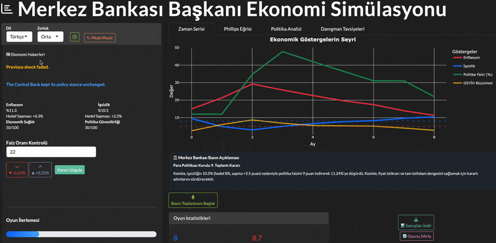
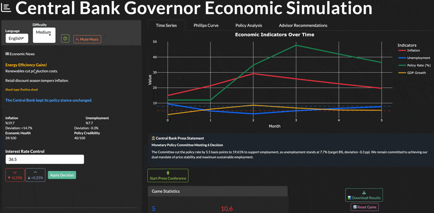
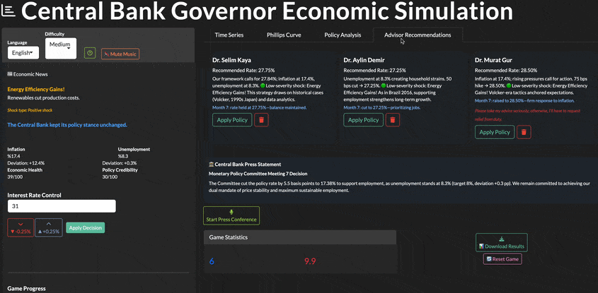
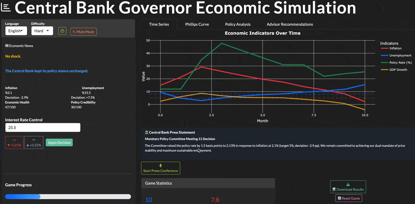
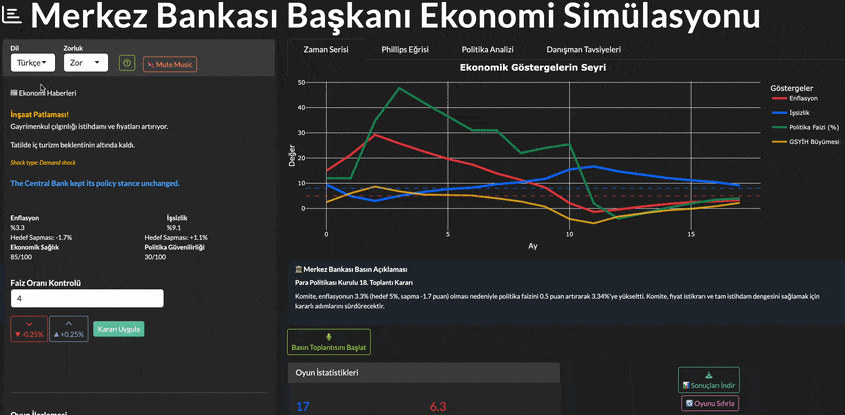
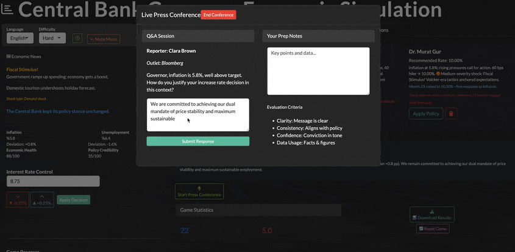
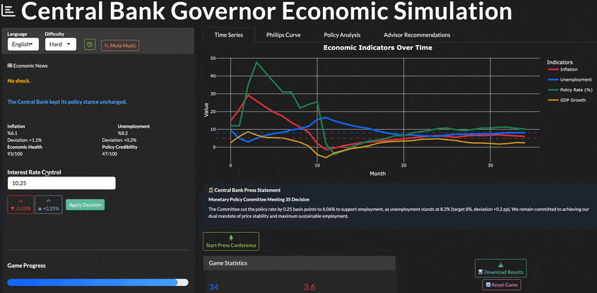

# Central Bank Game 🏦💹 <sup>Shiny → Shinylive</sup>

**Play now → <https://hutkudemir.github.io/central-bank-game/>**

## Gameplay snapshots

| | | |
|---|---|---|
|  |  |  |
|  |  |  |
|  |  |  |

---

## 🇬🇧 English

| What | Details |
|------|---------|
| **Role** | You are the central‑bank governor. Every month (36 turns) you set the policy rate, publish a press release, answer journalists, and react to random supply‑ or demand‑side shocks. |
| **Win** | Keep inflation ≈ 5 %, unemployment ≈ 8 %, and credibility high. |
| **Tech** | Built with **R** (`shiny`, `plotly`, `bslib`) and bundled to WebAssembly via **shinylive** — runs 100 % in the browser, no server needed. |

### Run locally

```r
git clone https://github.com/hutkudemir/central-bank-game.git
cd central-bank-game
install.packages("renv")
renv::restore()      # install locked deps
shiny::runApp()      # opens at http://localhost:1234
```

### Build the browser bundle

```r
install.packages("shinylive")
shinylive::export(appdir = ".", destdir = "dist", include_assets = "www")
```

### Repository layout

| Path | Purpose |
|------|---------|
| `app.R`               | Main entry point (sources `global.R`, `ui.R`, `server.R`) |
| `R/`                  | Pure game‑logic helpers (shock engine, advisor AI, …) |
| `www/`                | Static assets (CSS, audio, JS) |
| `dist/`               | Auto‑generated Shinylive bundle served on GitHub Pages |
| `.github/workflows/`  | CI: build & deploy workflow |

### Contributing

Bug fixes, balance tweaks, UI polish — PRs welcome!  
MIT License © Hüseyin Utku Demir

---

## 🇹🇷 Türkçe

| Başlık | Ayrıntı |
|--------|---------|
| **Rolünüz** | Merkez Bankası başkanısınız. 36 ay boyunca faiz oranını belirleyin, basın açıklaması yapın, gazetecilerin sorularını yanıtlayın ve rastgele arz‑talep şoklarıyla mücadele edin. |
| **Amaç** | Enflasyonu ≈ %5, işsizliği ≈ %8 seviyesinde tutup güvenilirliği yüksek korumak. |
| **Teknoloji** | `shiny`, `plotly`, `bslib` + **shinylive** (WebAssembly) → tamamı tarayıcıda çalışır, sunucu gerekmez. |

### Yerel çalıştırma

```r
git clone https://github.com/hutkudemir/central-bank-game.git
cd central-bank-game
install.packages("renv")
renv::restore()     # bağımlılıkları kur
shiny::runApp()     # http://localhost:1234 açılır
```

### Tarayıcı paketi oluşturma

```r
install.packages("shinylive")
shinylive::export(appdir = ".", destdir = "dist", include_assets = "www")
```

### Dizin yapısı

| Yol | Açıklama |
|-----|----------|
| `app.R`              | Ana dosya (global.R, ui.R, server.R çağırır) |
| `R/`                 | Oyun mantığı fonksiyonları |
| `www/`               | Statik dosyalar (CSS, ses, JS) |
| `dist/`              | Shinylive çıktısı (otomatik) |
| `.github/workflows/` | GitHub Actions — derle & Pages’e aktar |

### Katkı

Hata düzeltmeleri, denge güncellemeleri veya arayüz iyileştirmeleri için PR/issue açabilirsiniz.  
MIT Lisansı © Hüseyin Utku Demir
